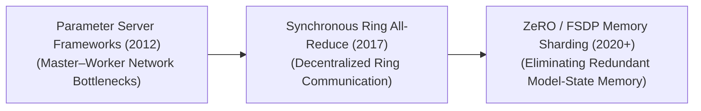
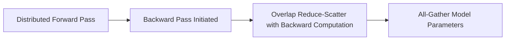

  

<!--
SEO Metadata:
Description: Curated resource list for Data Parallelism in AI, covering parameter servers, Ring All-Reduce, ZeRO, FSDP, DDP, and distributed training mechanics.
Keywords: Data Parallelism, Distributed Training, PyTorch DDP, FSDP, ZeRO, Parameter Server, Ring All-Reduce, Machine Learning, AI Infrastructure, Deep Learning Scaling
-->

# 🚀 Awesome Data Parallelism 🚀

  

## 📚 Data Parallelism in AI: History, Progression, Variants, & Applications

Data Parallelism (DP) is a core distributed hardware training framework designed to scale up deep learning operations across multiple computing nodes (GPUs/TPUs). When an artificial intelligence model’s dataset is too massive to process on a single hardware card within a reasonable timeframe, Data Parallelism shards the training batch across a cluster of parallel devices. Each independent worker node hosts a complete copy of the model weights, executes local forward and backward passes over its allocated data slice, and synchronizes the resulting mathematical gradients using low-level collective communication primitives (`All-Reduce`) before updating parameters simultaneously. It represents the most ubiquitous paradigm for accelerating the optimization workflows of modern Large Language Models and foundational Vision Transformers.

---

## 📅 1. The Macro Chronological Evolution

The technical optimization of parallel data distribution has transitioned from synchronous master-worker updates to fully decentralized ringing topologies and memory-sharded parameter-offloading frameworks.

| Era / Concept | Key Details | Year | First-Use Paper |
| :--- | :--- | :--- | :--- |
| [**The Asynchronous Parameter Server Era (~2012–2016)**](details/parameter_server.md) | **Concept:** Centralized master-worker configuration where standard worker nodes calculated independent gradients over data shards, sending them asynchronously to a central Parameter Server node that collected, averaged, and pushed updated weights back to the cluster.  **Limitation:** Created a severe centralized network bandwidth bottleneck as cluster sizes expanded. | 2012 | [Dean et al., 2012](https://proceedings.neurips.cc/paper/2012/hash/6cdd60ea0045eb7a6ec44c54d29ed402-Abstract.html) (Ref [1]) |
| [**The Synchronous Ring All-Reduce Era (Horovod / PyTorch DDP, ~2017–2020)**](details/ring_allreduce.md) | **Concept:** Arranged GPUs into a logical ring topology where each node communicated exclusively with its immediate left and right neighbors, executing Ring All-Reduce steps to sum and synchronize gradients incrementally.  **Significance:** Fully democratized distributed scale, allowing deep convolutional networks and early Transformers to scale across hundreds of GPUs with near-linear computing efficiency. | 2017 | [SergiE et al., 2017](https://eng.uber.com/horovod/) (Ref [2]) |
| [**The Zero Redundancy & Fully Sharded Parameter Era (ZeRO / FSDP, ~2020–Present)**](details/zero_redundancy.md) | **Concept:** Shards the optimizer states, gradients, and model parameters evenly across the entire data-parallel node array.  **Significance:** Eliminates parameter memory duplication completely, allowing clusters to train multi-billion parameter models cleanly without relying on brittle pipeline parallel cuts. | 2020 | [Rajbhandari et al., 2020](https://arxiv.org/abs/1910.02054) (Ref [4]) |

---

## 🏗️ 2. Core Functional & Architectural Variants

Data Parallelism frameworks are strictly categorized based on how memory boundaries are partitioned and how parameter arrays are loaded across distributed devices.

| Variant | Mechanism & Cons/Pros | Year | First-Use Paper |
| :--- | :--- | :--- | :--- |
| [**Data Parallel (DP / PyTorch Native Baseline)**](details/data_parallel.md) | **Mechanism:** Single-process, multi-threaded framework operating on a single host node. It shards a mini-batch across local GPUs, but duplicates full execution states over threads, bottlenecked severely by Python's Global Interpreter Lock (GIL).  **Cons:** Highly unoptimized; obsolete for large-scale foundation pre-training loops. | 2017 | [Li et al., 2020](https://arxiv.org/abs/2006.15704) (Ref [3]) |
| [**Distributed Data Parallel (DDP)**](details/distributed_data_parallel.md) | **Mechanism:** Multi-process paradigm where each individual GPU acts as a dedicated standalone worker process. Communication occurs strictly over optimized inter-node connections (e.g., NCCL over InfiniBand switches), wrapping the backward loop inside an automated `All-Reduce` gradient summation mask.  **Pros:** Exceptional scaling laws for models whose entire parameter and optimizer footprint fits inside the VRAM boundary of a single standalone GPU. | 2020 | [Li et al., 2020](https://arxiv.org/abs/2006.15704) (Ref [3]) |
| [**Fully Sharded Data Parallel (FSDP / ZeRO-Stage 3)**](details/fully_sharded_data_parallel.md) | **Mechanism:** Completely shards the model state array into three distinct execution stages: 1. *Stage 1:* Shards only the massive **Optimizer States** (saving up to $4\times$ memory). 2. *Stage 2:* Shards both the Optimizer States and the **Gradients** concurrently. 3. *Stage 3:* Shards the Optimizer States, Gradients, and **Model Parameters** completely.  **Pros:** Converts data parallelism into a hybrid memory-saving engine, allowing large architectures to run massive mini-batch sizes cheaply. | 2023 | [Zhao et al., 2023](https://arxiv.org/abs/2304.11277) (Ref [5]) |

---

## ⚡ 3. Communication Operations & Latency Mechanics

To synchronize parameters across independent data shards, distributed clusters must continually exchange tracking calculations using specialized collective primitives.

| Collective Primitive | Mathematical & Significance | Year | First-Use Paper |
| :--- | :--- | :--- | :--- |
| [**All-Reduce Primitives**](details/all_reduce.md) | **The Math:** Combines data arrays across all processes (e.g., summing gradients calculated over distinct data shards) and redistributes the clean, averaged global result uniformly back to every single process node. | 1994 | [MPI-1.0 Standard](https://www.mpi-forum.org/docs/mpi-1.0/mpi-report.pdf) |
| [**Reduce-Scatter Primitives**](details/reduce_scatter.md) | **The Math:** Modifies All-Reduce execution. It sums the gradient arrays across all nodes but distributes only a localized, fractioned segment (a shard) of the total summed gradient tensor to each individual card.  **Significance:** The fundamental memory-saving communication link underpining ZeRO-Stage 2 and FSDP architectures. | 1994 | [MPI-1.0 Standard](https://www.mpi-forum.org/docs/mpi-1.0/mpi-report.pdf) |
| [**All-Gather Primitives**](details/all_gather.md) | **The Math:** The inverse of Reduce-Scatter. It collects disjointed, sharded parameter pieces distributed across different devices, reconstructing a unified, global weight matrix array across all cards before initiating subsequent linear layer steps. | 1994 | [MPI-1.0 Standard](https://www.mpi-forum.org/docs/mpi-1.0/mpi-report.pdf) |

---

## 🛠️ 4. Production Engineering Challenges & Hardware Solutions

Deploying large-scale Data Parallelism pipelines across massive high-performance computing (HPC) clusters introduces severe network bandwidth bottlenecks and straggler issues.

| Challenge | Details & Mitigation | Year | First-Use Paper |
| :--- | :--- | :--- | :--- |
| [**The Network Communication Overhang and Interconnect Bottleneck**](details/network_overhang.md) | **The Problem:** As the data-parallel group size scales up across hundreds of nodes, the time required to execute collective communication operations (`All-Reduce` / `Reduce-Scatter`) increases aggressively.  **Mitigation:** Implementing **Gradient Bucket Accumulation and Overlapping** (streaming gradient communications in the background while early hidden layers are still executing backward passes), paired with high-bandwidth network buses (such as NVLink or InfiniBand architecture). | 2020 | [Li et al., 2020](https://arxiv.org/abs/2006.15704) (Ref [3]) |
| [**The Straggler GPU Synchronization Lock**](details/straggler_lock.md) | **The Problem:** Synchronous data parallelism is a hard-barrier protocol: all cards must finish their local batch calculation before global parameter reduction can finalize. A single GPU encountering thermal throttle or PCIe lane drop stalls the entire group.  **Mitigation:** Deploying automated, real-time **Cluster Monitoring Scaffolding**, which continuously monitors node compute velocities, automatically killing, re-routing, or re-initializing stale shards over functional healthy backup nodes via fault-tolerant snapshots. | 2020 | [Li et al., 2020](https://arxiv.org/abs/2006.15704) (Ref [3]) |

---

## 🌐 5. Frontier Real-World AI Infrastructure Applications

| Application Domain | Detailed Infrastructure Pattern | Year | First-Use Paper |
| :--- | :--- | :--- | :--- |
| [**Pre-Training Multi-Trillion Token Foundation LLMs (Megatron-LM / DeepSpeed Clusters)**](details/llm_pretraining.md) | **Application:** Serves as the fundamental orchestration baseline used to train elite base architectures (e.g., Llama 3 405B, DeepSeek-V3). Data Parallelism (via ZeRO-3 / FSDP) is layered alongside **Tensor Parallelism (TP)** and **Pipeline Parallelism (PP)** to form massive 3D parallel distributed supercomputing structures, scaling dataset token ingestion loops across thousands of nodes stably. | 2025 | [DeepSeek-V3 Technical Report](https://arxiv.org/abs/2412.19437) (Ref [6]) |
| [**High-Volume Generative Video Diffusion Simulation Scaling (Sora Class)**](details/video_diffusion.md) | **Application:** Drives large-scale physical simulation training workflows. Massive spatio-temporal video token cubes are sharded across large distributed data-parallel groups, allowing models to parse millions of continuous video sequences concurrently to optimize straight-line ODE trajectory maps rapidly. | 2024 | [Sora Technical Report](https://openai.com/research/video-generation-models-as-world-simulators) |
| [**Web-Scale Multimodal Representation Alignment Sprints (CLIP / OpenCLIP)**](details/multimodal_alignment.md) | **Application:** Optimizes contrastive vision-language pre-training blocks over billions of web-scraped image-caption rows. High-throughput Distributed Data Parallel (DDP) implementations distribute massive multi-device batch sizes (e.g., 32,768 images per step), ensuring the contrastive matrix receives enough negative samples. | 2021 | [CLIP (Radford et al., 2021)](https://arxiv.org/abs/2103.00020) |

---

## 📖 References
1. Dean, J., et al. (2012). Large scale distributed deep networks. *Advances in Neural Information Processing Systems (NeurIPS)*, 25, 1223-1231.
2. SergiE, A., et al. (2017). Meet Horovod: Uber’s open source distributed deep learning framework for TensorFlow. *Uber Engineering Research Monograph*.
3. Li, S., et al. (2020). PyTorch DDP: Accelerated distributed data parallel training. *arXiv preprint arXiv:2006.15704*.
4. Rajbhandari, S., et al. (2020). ZeRO: Memory optimizations toward training trillion parameter models. *Proceedings of the International Conference for High Performance Computing, Networking, Storage and Analysis*.
5. Zhao, Y., et al. (2023). PyTorch FSDP: Experiences on scaling foundational models via fully sharded data parallel architectures. *Proceedings of the VLDB Endowment*, 16(11).
6. DeepSeek-AI. (2025). DeepSeek-V3 Technical Report: Multi-node distributed associative scans over sharded data-parallel expert topologies. *GitHub Repository Technical Infrastructure Manifesto*.

---

To advance this documentation repository, structural setup, or architectural deployment pipeline, consider exploring these adjacent development pathways:
* Build a **Python script using PyTorch Distributed (`torch.distributed`)** illustrating how to initialize a multi-process execution group and wrap a standard neural network layer block inside an automated `DistributedDataParallel` module.
* Generate a **comprehensive Markdown table** explicitly comparing standard Distributed Data Parallel (DDP), Fully Sharded Data Parallel (FSDP), Pipeline Parallelism (PP), and Tensor Parallelism (TP) across communication frequencies, minimal network bandwidth demands, memory efficiency scaling, and maximum operational model parameter caps.
* Establish a **performance profiling notebook using DeepSpeed** to track the exact computational throughput, communication-to-computation overlap ratios, and VRAM memory saving bounds achieved when shifting a distributed training run across ZeRO Stage 1, Stage 2, and Stage 3 parameter configurations.

## Star History

<a href="https://www.star-history.com/?repos=ishandutta2007%2FAwesome-Data-Parallelism&type=date&legend=bottom-right">
<picture>
<source media="(prefers-color-scheme: dark)" srcset="https://api.star-history.com/chart?repos=ishandutta2007/Awesome-Data-Parallelism&type=date&theme=dark&legend=bottom-right" />
<source media="(prefers-color-scheme: light)" srcset="https://api.star-history.com/chart?repos=ishandutta2007/Awesome-Data-Parallelism&type=date&legend=bottom-right" />

</picture>
</a>

***

**Proactive Repository Follow-Ups:**

To assist with your documentation repository setup, let me know how you would like to proceed by choosing one of the options below:
* I can provide a **complete Python code boilerplate using PyTorch and DeepSpeed** demonstrating how to write an automated launch configuration file to execute a ZeRO-Stage 3 sharded training script across distributed nodes.
* I can generate a **Markdown matrix table** tracking the specific network communication overheads and cluster collective primitive patterns (`All-Reduce`, `Reduce-Scatter`, `All-Gather`) utilized by leading AI supercomputing infrastructures.
* I can write a detailed technical explanation focusing on **how to configure Gradient Accumulation Steps dynamically** at runtime to balance low network bandwidth bounds over consumer-grade distributed cloud server clusters.

