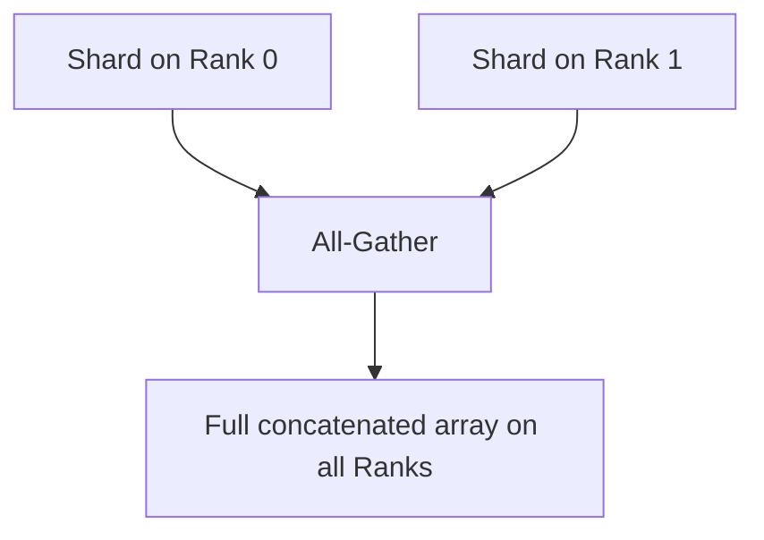

# All-Gather Primitives

## Architecture & Workflow

## Overview

All-Gather collects sharded data blocks from all ranks and concatenates them, distributing the complete concatenated array back to every rank. It is the inverse of the Scatter operation.
