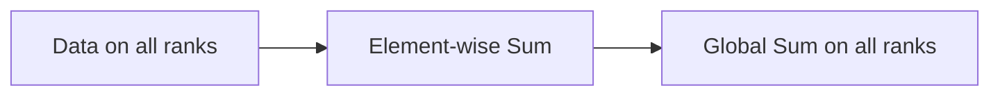

# All-Reduce Primitives

## Architecture & Workflow

## Overview

All-Reduce is a collective operation that sums (or aggregates) values across all nodes and redistributes the global result back to all of them. It is the core primitive for gradient synchronization in data-parallel training.
