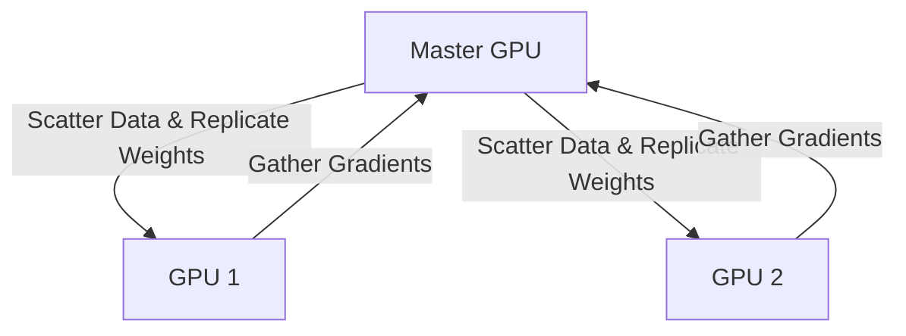

# Data Parallel (DP / PyTorch Native Baseline)

## Architecture & Workflow

## Overview

PyTorch DataParallel (DP) operates on a single machine by replicating the model on each GPU and using multi-threading to parallelize execution. However, it suffers from severe GIL (Global Interpreter Lock) bottlenecks and overheads.
