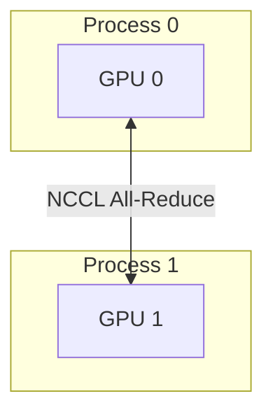

# Distributed Data Parallel (DDP)

## Architecture & Workflow

## Overview

Distributed Data Parallel (DDP) runs a separate process per GPU. Gradient synchronization is performed using optimized NCCL All-Reduce, eliminating Python GIL bottlenecks and scaling efficiently across multiple machines.
