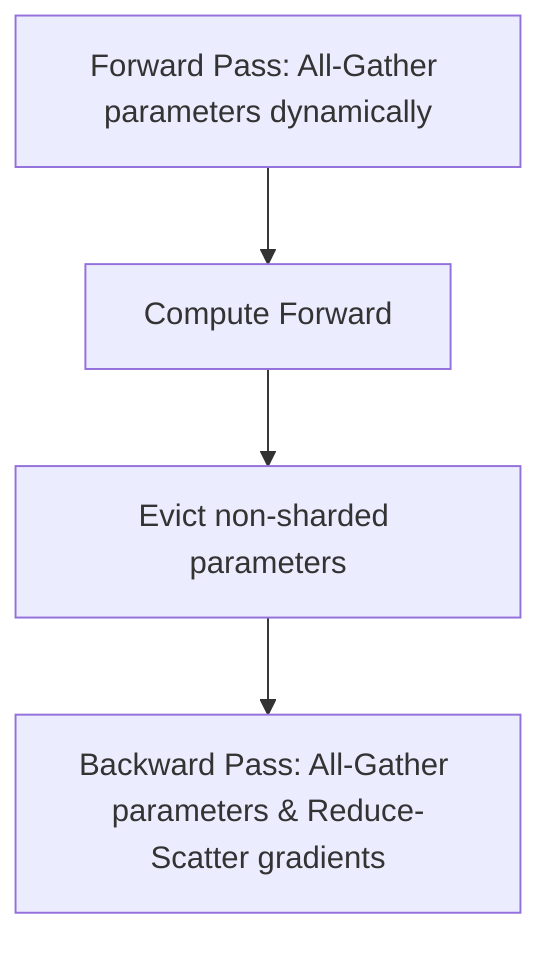

# Fully Sharded Data Parallel (FSDP / ZeRO-Stage 3)

## Architecture & Workflow

## Overview

FSDP shards all model parameters, gradients, and optimizer states across processes. Parameters are dynamically reconstructed via All-Gather before each forward/backward layer computation and immediately freed afterward, maximizing memory efficiency.
