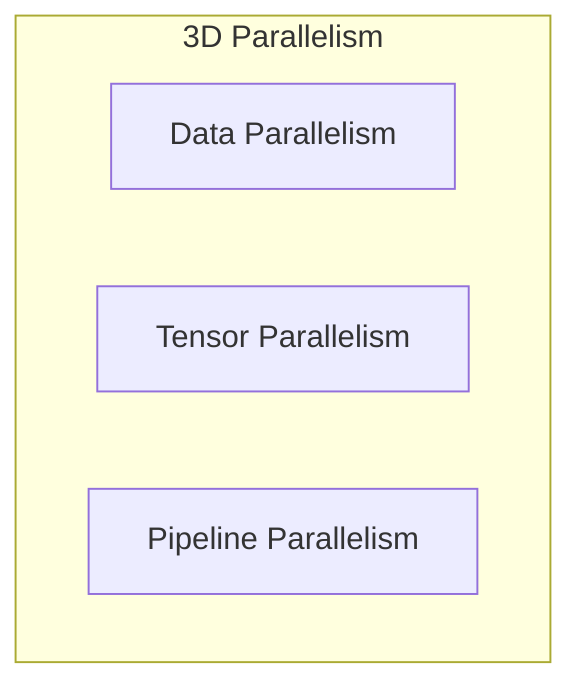

# Pre-Training Multi-Trillion Token Foundation LLMs (Megatron-LM / DeepSpeed Clusters)

## Architecture & Workflow

## Overview

Pre-training LLMs at scale uses hybrid 3D Parallelism, combining Data Parallelism (ZeRO/FSDP), Tensor Parallelism (sharding layers), and Pipeline Parallelism (sharding stages) to distribute the massive model and dataset.
