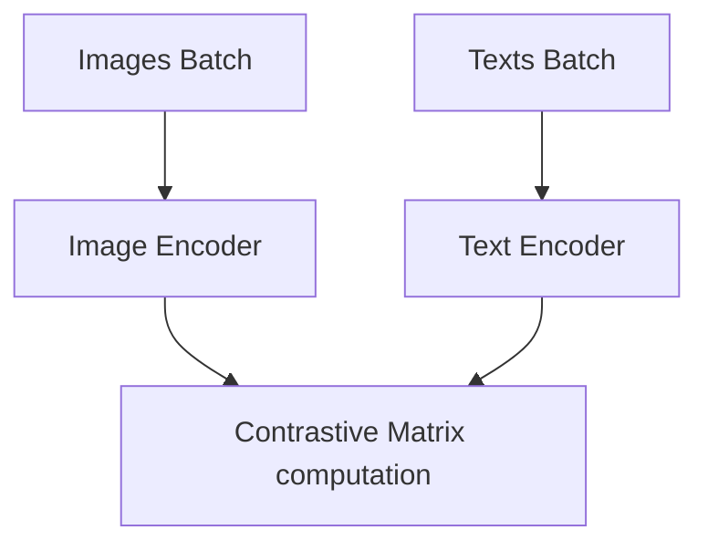

# Web-Scale Multimodal Representation Alignment Sprints (CLIP / OpenCLIP)

## Architecture & Workflow

## Overview

Web-scale contrastive training (e.g., CLIP) aligns image and text embeddings. Using high-throughput Distributed Data Parallel (DDP) enables extremely large batch sizes to maximize negative samples and stabilize contrastive learning.
