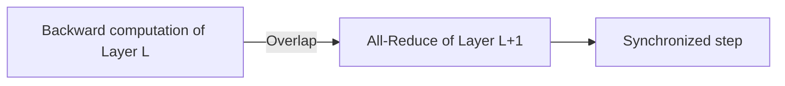

# The Network Communication Overhang and Interconnect Bottleneck

## Architecture & Workflow

## Overview

In distributed scaling, slow network fabrics block high-performance GPUs. Mitigation techniques include gradient bucketing and overlapping communication (All-Reduce/Reduce-Scatter) in the background with current layer backward passes.
