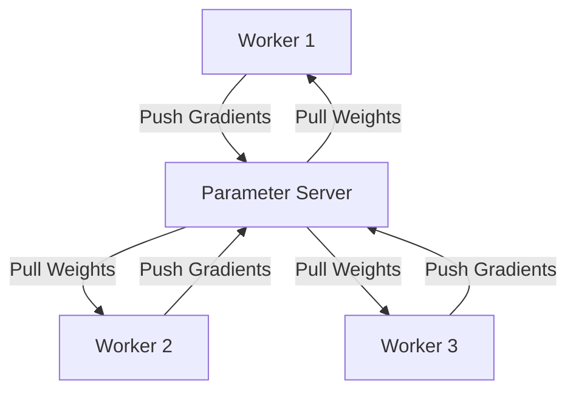

# Asynchronous Parameter Server Era

## Architecture & Workflow

## Overview

The Parameter Server architecture relies on a centralized manager-worker layout. Worker nodes compute local gradients asynchronously and push them to the parameter server, which updates weights and broadcasts them back. The central node can become a major network bandwidth bottleneck in large clusters.
