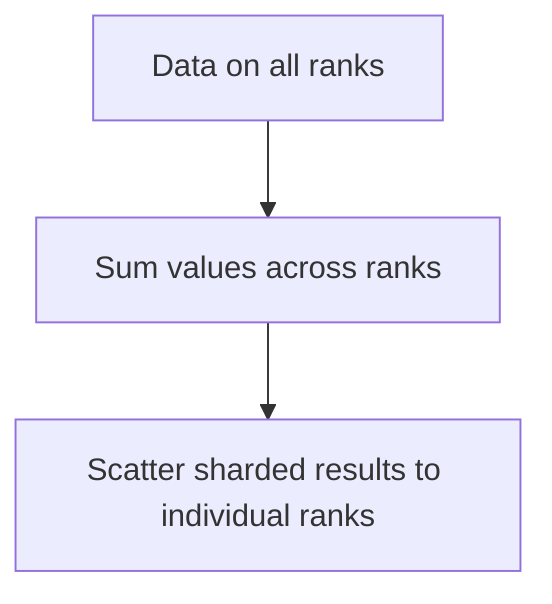

# Reduce-Scatter Primitives

## Architecture & Workflow

## Overview

Reduce-Scatter is a collective primitive that performs a reduction operation on vectors across ranks and scatters the reduced blocks evenly across them, so each rank receives a unique shard of the final result.
