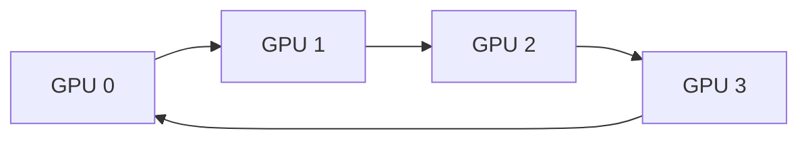

# Synchronous Ring All-Reduce Era

## Architecture & Workflow

## Overview

Ring All-Reduce arranges nodes in a logical ring topology. Each GPU sends data to its successor and receives data from its predecessor. Communication scales optimally with the number of devices and is independent of cluster size, eliminating the central server bottleneck.
