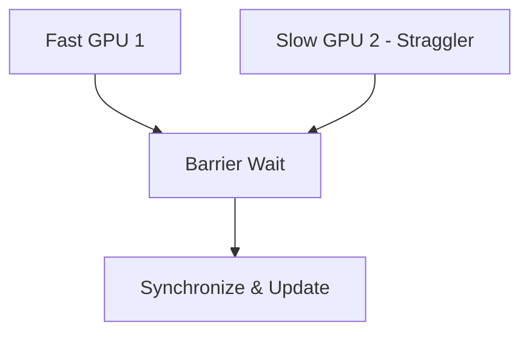

# The Straggler GPU Synchronization Lock

## Architecture & Workflow

## Overview

Synchronous training progresses as fast as the slowest GPU (straggler). Dynamic monitoring frameworks, failovers, thermal management, and robust health checks are required to resolve and prevent cluster-wide stalls.
