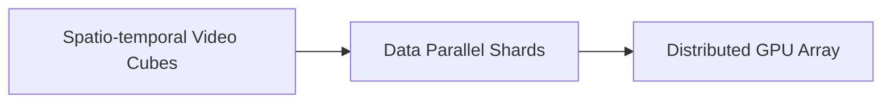

# High-Volume Generative Video Diffusion Simulation Scaling (Sora Class)

## Architecture & Workflow

## Overview

Generative video diffusion models process large spatio-temporal video sequences. Sharding these massive video tokens across data-parallel systems allows processing diverse visual scenarios concurrently.
