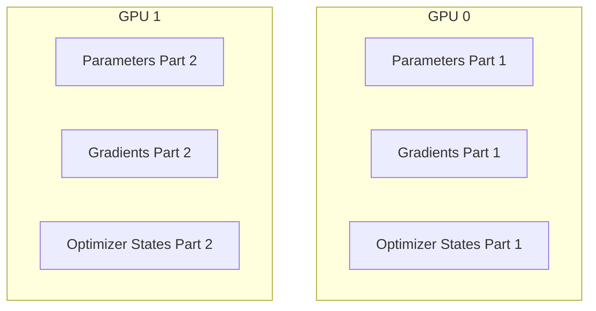

# Zero Redundancy & Fully Sharded Parameter Era

## Architecture & Workflow

## Overview

ZeRO (Zero Redundancy Optimizer) eliminates memory redundancy in data-parallel training by sharding the optimizer states, gradients, and model parameters across GPUs instead of replicating them. This unlocks the ability to train massive foundational models.
